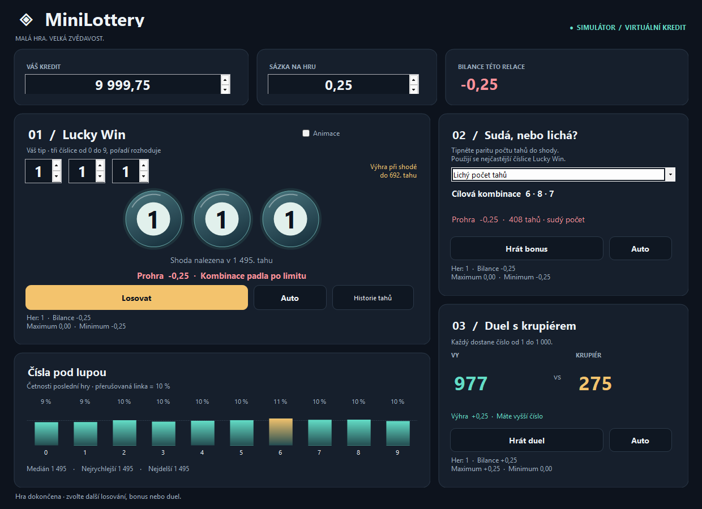

# MiniLottery 1.1 — visual refresh

Desktopový simulátor pro Windows, C# / Windows Forms / .NET 8. Kredit je virtuální; aplikace nemá platby ani připojení k herní službě.



Ověřeno na Windows v [CI běhu 34754794602](https://github.com/RadimStud/devproject/actions/runs/34754794602): 313 kontrol pravidel, 22 kontrol UI, build bez varování. [Testovací Windows balíček a screenshoty](https://github.com/RadimStud/devproject/actions/runs/34754794602/artifacts/10317485238). Náhled zachycuje skutečné nativní ovládací prvky v rozložení 1240 × 900; hodnoty jsou z náhodného testovacího běhu.

## Spuštění

Z kořene repozitáře v PowerShellu s .NET 8 SDK:

```powershell
dotnet run --project .\minilottery\Simulation.csproj -c Release
```

Samostatný balíček pro počítače bez .NET:

```powershell
dotnet publish .\minilottery\Simulation.csproj -c Release -r win-x64 --self-contained true -o .\artifacts\MiniLottery
```

Spouští se `artifacts\MiniLottery\MiniLottery.exe`. Staré soubory v `bin/Debug/net6.0-windows`, které jsou už v historii repozitáře, neobsahují tento redesign.

## Analýza původní verze

- Pevné absolutní souřadnice, malé vstupy a texty, nevyužité plochy; statistický panel zasahoval pod spodní okraj výchozího okna.
- Náhodné přebarvování tlačítek bez významu; technické popisky `Button1`, `label24` a směs angličtiny a češtiny.
- `Application.DoEvents()` uvnitř losování umožňovalo opakované spuštění, souběžné hry a změny sázky během hry.
- Bonusový checkbox byl označen `Win Odd`, ale zaškrtnutí ve skutečnosti vyhrávalo na sudém počtu tahů.
- Extrémy hlavní hry se počítaly před aktualizací bilance a ukládaly do `int`, čímž ztrácely desetinné hodnoty.

## Co se změnilo

Tmavé rozhraní, zlaté hlavní tlačítko, tyrkysové výsledky, vlastní vektorově kreslené číselné koule, graf četností 0–9, kompaktní karty všech tří her. Grafika nepotřebuje obrázky, síť, webový prohlížeč ani nové grafické balíčky.

Tabulkové rozložení se přizpůsobuje šířce; nižší okno má posuvník. Windows škáluje rozhraní podle DPI. Nativní číselné vstupy, pojmenované ovládací prvky, klávesnicový fokus a vypínatelná animace zůstávají dostupné.

Hra používá malé asynchronní dávky. Sázka a volby jsou během hry zamčené. `Zrušit` / `Zastavit` ukončí nedokončenou hru bez změny kreditu; dokončené hry se účtují právě jednou. Auto čeká sekundu mezi hrami. Neplatná sázka a nedostatečný kredit hru nespustí. Kredit lze upravit mimo hru.

Historie uchovává posledních 100 tahů Lucky Win a bonusu; četnosti zahrnují všechny tahy poslední dokončené hry Lucky Win. Medián a extrémy počtu tahů zahrnují dokončené Lucky Win hry této relace. Maximum/minimum bilance jsou extrémy kumulativní bilance daného režimu včetně výchozí nuly. Nastavení a statistiky se zatím neukládají mezi spuštěními.

## Zachovaná pravidla

| Režim | Podmínka výhry |
| --- | --- |
| Lucky Win | Přesná uspořádaná trojice číslic 0–9 padne v tahu 1–692; od 693. tahu prohra. |
| Bonus | Parita počtu tahů do přesné shody odpovídá volbě hráče. Cíl tvoří tři nejčastější číslice posledního Lucky Win; před první hrou 1 · 1 · 1. Shodné četnosti se řadí podle číslice. |
| Duel | Číslo hráče 1–1 000 je větší než číslo krupiéra 1–1 000; remíza patří krupiérovi. |

Každá dokončená hra změní kredit o +sázku nebo −sázku. Četnosti popisují minulá losování, nezvyšují pravděpodobnost budoucí shody. Hraní za skutečné peníze není součástí aplikace.

## Ověření

```powershell
dotnet run --project .\tests\MiniLottery.CoreTests -c Release
dotnet build .\minilottery\Simulation.csproj -c Release --warnaserror
dotnet run --project .\tests\MiniLottery.SmokeTests -c Release -- artifacts/screenshots
```

Windows smoke test otevírá skutečnou aplikaci, odehraje všechny režimy, ověří kredit, souběh, zastavení automatu, zrušení hry, nedostatek kreditu a zavření během hry. Ukládá screenshoty výchozího, odehraného a zmenšeného okna. Na Linuxu lze zkompilovat Windows cíl, ale samotné Windows Forms UI vyžaduje Windows. GitHub Actions vytváří review artefakt se screenshoty a samostatným ZIP; nic automaticky nenasazuje na MiniKit.
